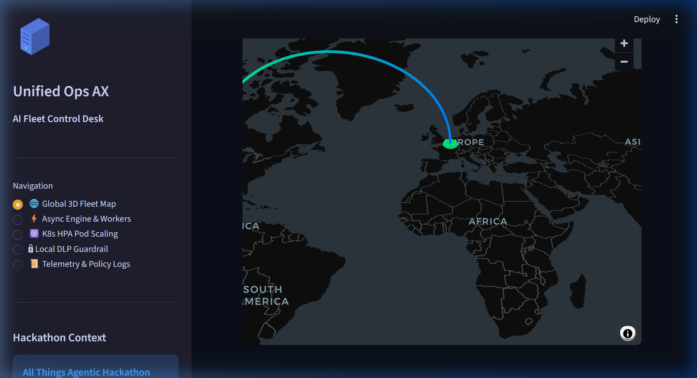
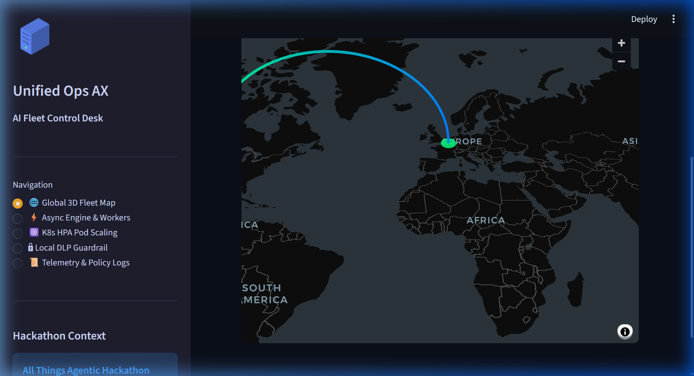

# 🚀 Unified Ops AX — Autonomous AI Fleet Telemetry & Self-Healing Remediation Engine

> **[All Things Agentic Hackathon (Devpost)](https://allthingsagentichackathon.devpost.com/)** — Category: **Fortified Enterprise Fleet**  
> Built with: **Google Agent Development Kit (ADK)** + **Google GenAI SDK** + **Gemini 3.5 Flash** + **Google Cloud Pub/Sub**  

[](https://unified-ops.streamlit.app/)
[](https://github.com/sechan9999/unified-ops-ax)

---

## 🌐 Live Web App & Screenshots

👉 **Live Control Center**: **[https://unified-ops.streamlit.app/](https://unified-ops.streamlit.app/)** *(Alternative: [https://splunkax.streamlit.app/](https://splunkax.streamlit.app/))*  
👉 **GitHub Repository**: **[https://github.com/sechan9999/unified-ops-ax](https://github.com/sechan9999/unified-ops-ax)**

### 🖥️ App Screenshots & PyDeck 3D Control Center


*Unified Ops AX Control Center displaying real-time 3D spatial flow map, background worker metrics, and K8s pod scaling controls.*


*PyDeck 3D Spatial Fleet Flow Map displaying multi-region telemetry ingest across GCP `us-central1` (Iowa), `europe-west1` (Belgium), and `asia-east1` (Taiwan).*

---

## 🎯 Core Innovation: Closed-Loop Agentic Ops

MCPAgents **observes Splunk (Tool)** + **Splunk monitors MCPAgents (Observability)** — a bidirectional closed loop:

```
MCPAgents                    Splunk Platform
─────────────────────────────────────────────────────────
① LLM/Tool events ──HEC──▶  Splunk Cloud (index=mcp_agents)
② Tool Manager    ◀──MCP──  Splunk MCP Server (GA 2026)
③ DLP Violation   ──WH──▶   Splunk SOAR (Foundation-sec)
④ Splunk Alert    ──WH──▶   Auto-Remediation (CDTS anomaly)
⑤ Dashboard       ◀──SPL──  Splunk Live Panels
```

---

## 📦 Project Structure

### New Files

| File | Week | Description |
|------|------|-------------|
| `splunk_telemetry.py` | Week 1 | Async batch HEC telemetry emitter with retry logic |
| `tools/splunk_mcp_tool.py` | Week 2 | Splunk MCP Server Tool connector + NL→SPL translation |
| `security/soar_bridge.py` | Week 3 | DLP → Foundation-sec scoring → SOAR playbook automation |
| `security/__init__.py` | Week 3 | SOARBridge export |
| `auto_remediation.py` | Week 4 | CDTS anomaly detection → Router auto-remediation loop |
| `demo_app.py` | — | Streamlit demo app (Demo Mode + live backend support) |
| `splunk_app/` | — | Splunk Enterprise App package (saved searches, Modular Input) |
| `main.py` | — | FastAPI unified entry point (all modules initialized) |

### Modified Files (Graceful Degradation — original functionality 100% preserved)

| File | Week | Changes |
|------|------|---------|
| `multi_llm_platform/llm_router.py` | Week 1 | Added `emit_router_decision`, `emit_cache_hit/miss` hooks |
| `multi_llm_platform/semantic_cache.py` | Week 1 | Added `emit_cache_hit/miss` hooks |
| `advanced_agent.py` | Week 2–4 | Registered `splunk_query` tool, DLP scan integration, HEC telemetry hooks |
| `enterprise_mcp_connector/tool_manager.py` | Week 2 | Added `SplunkPlugin` class + `PLUGIN_REGISTRY["splunk"]` |

---

## 🚀 Quick Start

### Option A: Streamlit Cloud (Instant Demo)

Visit **[https://splunkhec.streamlit.app/](https://splunkhec.streamlit.app/)** — Demo Mode is on by default. No setup required.

### Option B: Local Development

#### 1. Install Dependencies
```bash
pip install -r requirements-full.txt
```

#### 2. Configure Environment
```bash
cp .env.example .env
# Set SPLUNK_HEC_URL and SPLUNK_HEC_TOKEN
```

#### 3. Docker Compose (Splunk + MCPAgents + Redis)
```bash
docker-compose up
# Splunk Web:  http://localhost:8000  (admin / set via SPLUNK_PASSWORD)
# MCPAgents:   http://localhost:8001
# Redis:       localhost:6379
```

#### 4. Run Streamlit Demo App
```bash
streamlit run demo_app.py
# → http://localhost:8501
# Toggle Demo Mode OFF in sidebar to connect to live backends
```

#### 5. Component Tests
```bash
python splunk_telemetry.py        # HEC event emission test
python tools/splunk_mcp_tool.py   # NL→SPL query test
python security/soar_bridge.py    # DLP→SOAR pipeline test
python auto_remediation.py        # Auto-remediation test
```

---

## 🧪 Reproducible Testing & Verification

We provide **100% reproducible automated testing** with zero external network dependencies required:

### 1. Full Automated Test Suite (`pytest`)
Runs all 25 unit and integration tests across async workers, GCP Pub/Sub, Kafka streaming, K8s pod scaling, local DLP PII guardrails, and agent orchestrators:
```bash
pytest tests/ -v
# Expected: 25 passed in < 5.0 seconds
```

### 2. Hackathon Benchmark & Interactive Showcase
Executes a 5-stage benchmark processing 2,000 log events, triggering sub-10ms auto-remediation, executing K8s HPA pod scaling (2 -> 8 replicas), and masking PII with SHA-256 signatures:
```bash
python hackathon_showcase.py
```

### 3. End-to-End System Verification Suite
Exercises all 14 subsystem checks (actors, RAG security trimming, RLS, audit logging, MCP server):
```bash
python verify.py
# Exit 0 = all green
```

### 4. Interactive Fleet Control Dashboard
Launches the live Streamlit + PyDeck 3D control center locally:
```bash
streamlit run streamlit_app.py --server.port 8501
# View at http://localhost:8501 or https://unified-ops.streamlit.app/
```

---

#### 6. Standalone Server (without Docker)
```bash
python main.py --server
# → http://localhost:8000/health
# → http://localhost:8000/docs        (Swagger UI)
# → http://localhost:8000/splunk/alert (Splunk Alert webhook)
# → http://localhost:8000/agent/run   (Agent API)
```

---

## 🏗️ Architecture

### End-to-End (how LLMai interacts with Splunk + AI)

```
                    LLMai — Closed-Loop Agentic Ops on Splunk

  ┌──────────────── LLMai (FastAPI + AdvancedMCPAgent) ─────────────────┐
  │  User ▶ Streamlit Control Center ▶ /agent/run ▶ Multi-LLM Router    │
  │         (4 tabs, Demo Mode)          │          + Semantic Cache     │
  │  Tools: splunk_query · supabase_query · code/web/data ...            │
  └──┬──────────────┬───────────────┬───────────────┬───────────────────┘
     │① HEC          │② MCP/REST     │③ DLP webhook   │④ CDTS alert webhook
     │ telemetry     │ NL→SPL        │ PII risk       │ POST /splunk/alert
     ▼               ▼ ▲             ▼                ▲
  ┌──────────────────┼─────────────────────────────────┼─────────────────┐
  │ SPLUNK PLATFORM   │                                 │                 │
  │ index=mcp_agents ◀┘  Splunk MCP Server ─────────────┘  Splunk SOAR    │
  │ dashboards / SPL     Foundation-sec PII scoring        (6 playbooks)  │
  │                                                        CDTS anomaly   │
  └──────────────────────────────────────────────────────────┬───────────┘
     ▲                                                         │
     └────────── ④ auto-remediation: router re-weight ◀────────┘
                  (runtime, auto-restore after cooldown)

  Security: X-MCP-Token (env-gated, constant-time) on /agent/run,
            /splunk/alert, /metrics/* · DLP→SOAR · creds via env only
```

### ① Splunk HEC Telemetry Emitter (`splunk_telemetry.py`)
```python
from splunk_telemetry import get_telemetry, init_telemetry

tel = init_telemetry(hec_url, hec_token)
tel.emit_llm_call(model="claude-sonnet-4", cost_usd=0.003, latency_ms=780)
tel.emit_router_decision(complexity="COMPLEX", selected_model="claude-sonnet-4")
tel.emit_dlp_violation(rule_id="DLP-001", action_taken="block")
```

### ② Splunk MCP Tool (`tools/splunk_mcp_tool.py`)
```python
from tools.splunk_mcp_tool import SplunkMCPTool

tool = SplunkMCPTool()
result = tool.execute("What was the LLM cost in the last hour?")
# → Auto-generates SPL + queries via Splunk MCP Server or REST API
```

### ③ DLP → SOAR Bridge (`security/soar_bridge.py`)
```python
from security.soar_bridge import patch_dlp_engine_with_soar
from enterprise_mcp_connector.dlp_policy import DLPPolicyEngine

engine = DLPPolicyEngine()
patch_dlp_engine_with_soar(engine)
# → On DLP violation: Foundation-sec risk scoring + SOAR playbook trigger
```

### ④ Auto-Remediation (`auto_remediation.py`)
```python
from auto_remediation import get_anomaly_handler

handler = get_anomaly_handler()
handler.handle({"result": {"anomaly_type": "cost_spike", "metric_value": "8.5"}})
# → Increases Router cost_weight + switches to lower-cost model
```

---

## 📊 Splunk App Installation

```bash
# Install the app on Splunk Enterprise
cp -r splunk_app $SPLUNK_HOME/etc/apps/mcpagents_splunk
$SPLUNK_HOME/bin/splunk restart

# Create HEC Token (via Splunk Web)
# Settings → Data Inputs → HTTP Event Collector → New Token
# → index: mcp_agents, sourcetype: mcp:agent:event
```

### 📈 Dashboard

Dashboard Studio definition: [`splunk_app/dashboards/mcp_agents_overview.json`](splunk_app/dashboards/mcp_agents_overview.json)

Import: **Splunk → Dashboards → Create New → Dashboard Studio → ⋮ Source → paste the JSON → Save.**

> **LLMai — Agentic Ops Dashboard.** A single Dashboard Studio view over `index=mcp_agents`, the live HEC feed from the MCPAgents × Splunk platform. KPI tiles show 24-hour LLM spend, call volume, semantic-cache hit rate, and DLP violations; charts break cost and routing down by model; and tables surface anomalies that triggered autonomous remediation and every DLP event with its rule, sensitivity, and action taken. It makes the project's core innovation visible in one screen: the AI agent streams telemetry into Splunk, and Splunk's anomaly detection feeds back to reconfigure the agent — a closed observability loop.

---

## 🏆 Hackathon Tracks

| Track | Implementation |
|-------|---------------|
| **Observability** | HEC Telemetry + CDTS anomaly detection + Auto-Remediation loop |
| **Security** | DLP → Foundation-sec scoring → SOAR playbook automation |
| **Platform** | Splunk MCP Server Tool + Modular Input + SPL natural language query |

---

## 📄 License

Licensed under the **Apache License 2.0** — see [`LICENSE`](LICENSE).

```
Copyright 2026 sechan9999
Licensed under the Apache License, Version 2.0 (the "License");
you may not use this file except in compliance with the License.
You may obtain a copy of the License at http://www.apache.org/licenses/LICENSE-2.0
```
