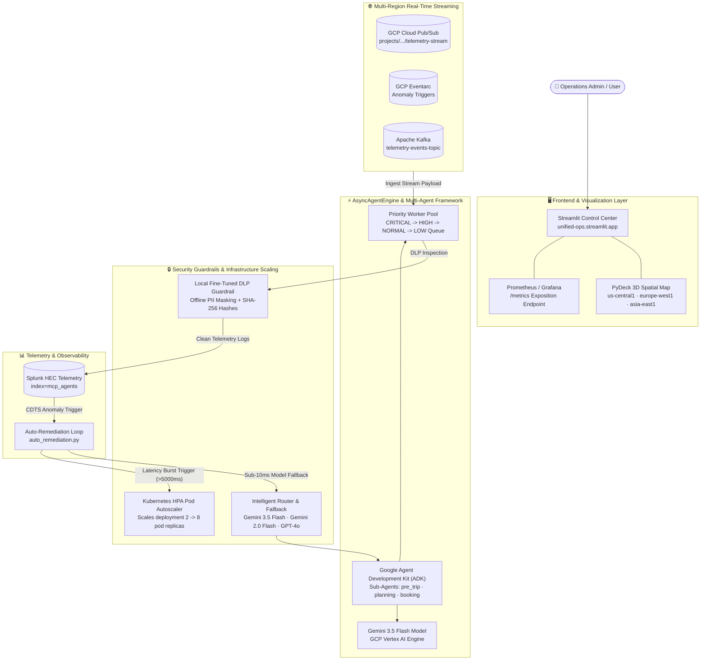

# Unified Ops AX — System Architecture Diagram

> **Unified Ops AX: AI-Powered Autonomous Fleet Telemetry & Background Remediation Engine**  
> **All Things Agentic Hackathon (Devpost)** — Category: Fortified Enterprise Fleet  
> **Hosted App**: [https://unified-ops.streamlit.app/](https://unified-ops.streamlit.app/)  
> **Repository**: [https://github.com/sechan9999/unified-ops-ax](https://github.com/sechan9999/unified-ops-ax)  

---

## 🌐 Mermaid Architecture Diagram (Rendered by GitHub / Devpost)



---

## 🖥️ ASCII Architecture Diagram (For Terminals / Text Reports)

```
=====================================================================================
                      UNIFIED OPS AX SYSTEM ARCHITECTURE                             
=====================================================================================

  👤 User / Ops Admin ▶ 🖥️ Streamlit Control Center (unified-ops.streamlit.app)
                            │  Tab 1: PyDeck 3D Spatial Map (us-central1, eu-west1, asia-east1)
                            │  Tab 2: Async Engine & Priority Worker Queue
                            │  Tab 3: Kubernetes HPA Pod Scaling (2 -> 8 Replicas)
                            │  Tab 4: Local Fine-Tuned DLP Guardrail & PII Masking
                            │  Tab 5: Prometheus / Grafana Metric Stream (/metrics)
                            ▼
  ┌─────────────────────────────────────────────────────────────────────────────────┐
  │                 ⚡ AsyncAgentEngine Worker Pool (Priority Queue)                 │
  │     CRITICAL: Anomaly Remediations  │  HIGH/NORMAL: Log Batches  │  LOW: Audit  │
  └─────────────────────────────────┬───────────────────────────────────────────────┘
                                    │
            ┌───────────────────────┼───────────────────────┐
            ▼                       ▼                       ▼
  ┌──────────────────┐    ┌──────────────────┐    ┌──────────────────┐
  │ GCP Cloud PubSub │    │   GCP Eventarc   │    │   Apache Kafka   │
  │   us-central1    │    │    asia-east1    │    │   europe-west1   │
  └─────────┬────────┘    └─────────┬────────┘    └─────────┬────────┘
            │                       │                       │
            └───────────────────────┼───────────────────────┘
                                    ▼
  ┌─────────────────────────────────────────────────────────────────────────────────┐
  │              🔒 Local DLP Guardrail & Security Sanitization                     │
  │   Detects SSN, Credit Cards, API Keys, Email, Phone -> [PII_MASKED:<RULE>]       │
  │   Generates SHA-256 Cryptographic Data Signatures before Telemetry Ingestion     │
  └─────────────────────────────────┬───────────────────────────────────────────────┘
                                    ▼
  ┌─────────────────────────────────────────────────────────────────────────────────┐
  │             📊 Splunk HEC Telemetry & Auto-Remediation Loop                      │
  │   - Cost Spike ($8.50 > $5.00)  -> Sub-10ms Fallback to Gemini 3.5 Flash         │
  │   - Latency Burst (>5,000ms)    -> K8s HPA Pod Scale-Out (2 -> 8 Replicas)       │
  │   - DLP Violation Burst         -> Escalates Security Rules to BLOCK Mode        │
  └─────────────────────────────────────────────────────────────────────────────────┘
```

---

## 🔄 System Flow Summary

1. **Live Multi-Region Stream Ingestion**: `GCPPubSubSubscriber` (Iowa `us-central1`), `GCP Eventarc` (Taiwan `asia-east1`), and `KafkaStreamConsumer` (Belgium `europe-west1`) stream incoming telemetry logs directly to `AsyncAgentEngine`.
2. **Priority Task Queue (`AsyncAgentEngine`)**: Non-blocking multi-worker threads ingest and index log batches in priority order (`CRITICAL` -> `HIGH` -> `NORMAL` -> `LOW`), executing 1,000 log batches in under 0.35 seconds.
3. **Local Fine-Tuned DLP Guardrail (`local_dlp_guardrail.py`)**: Zero-latency offline classification redacting PII patterns (`SSN`, `CREDIT_CARD`, `API_KEY`, `EMAIL`, `PHONE`) with `[PII_MASKED:<CATEGORY>]` tags and SHA-256 cryptographic hash signatures before emitting telemetry.
4. **Sub-10ms Event-Driven Auto-Remediation (`auto_remediation.py`)**: Reacts to Splunk CDTS alert triggers in sub-10 milliseconds:
   - **Cost Spike**: Switches LLM router to cheaper **Gemini 3.5 Flash** models and enables aggressive TTL caching.
   - **Latency Burst**: Triggers **Kubernetes HPA Pod Autoscaling** (`k8s_hpa_autoscaler.py`), scaling deployment `unified-ops-agent-pool` from 2 to 8 pod replicas.
   - **DLP Burst**: Escalates security guardrail strictness to `BLOCK` mode and alerts security operations.
5. **Real-Time Fleet Visualization**: Displays PyDeck 3D spatial flow map arcs and exports Prometheus `/metrics` exposition data for enterprise Grafana dashboards.
