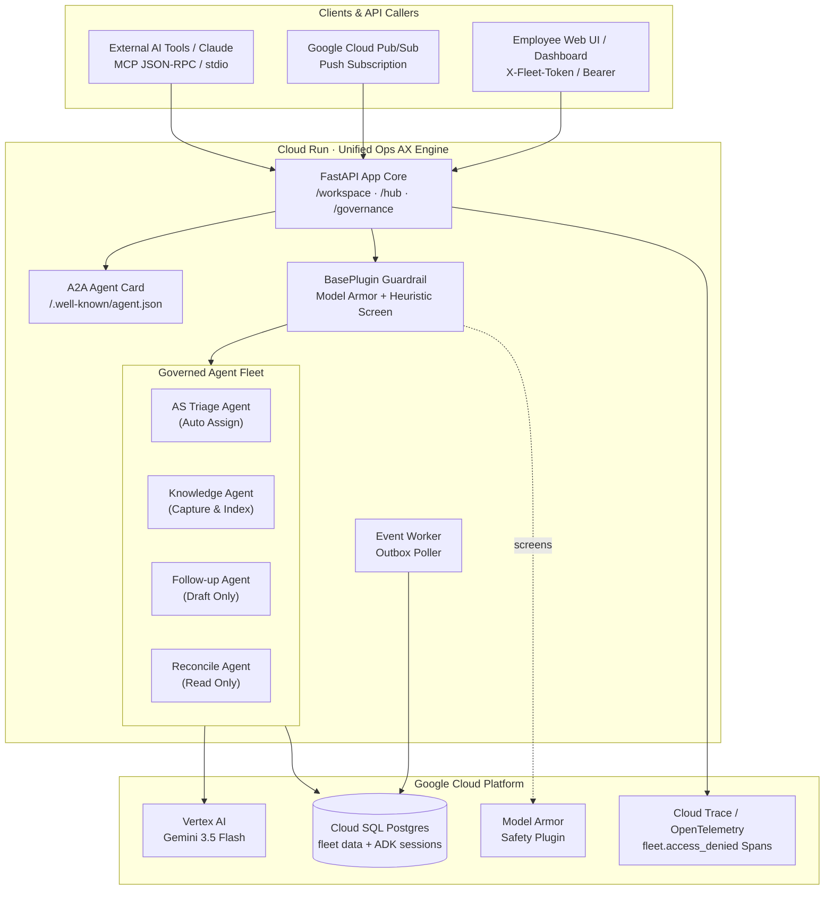
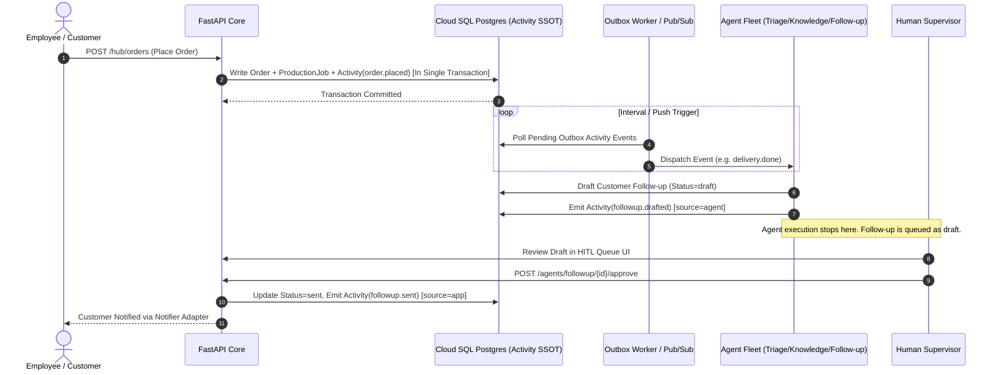

# Unified Ops AX & Gemini Ops Fleet — Architecture

This document details the three core architectural views of **Unified Ops AX** and **Gemini Ops Fleet**:
1. **System Map:** Cloud Run microservices, Vertex AI, Google ADK, and infrastructure components.
2. **Safety Authorization Path:** Deterministic code-enforced security boundaries (SQL trimming, zero-trust tools, HTTP 409 human gate).
3. **Asynchronous Event-Driven Pipeline:** Event outbox, Pub/Sub trigger, and automated agent dispatching.

---

## 1. System Map



---

## 2. Safety Authorization Path (The 3 Hard Guarantees)

Every security boundary is enforced in Python and SQL code before or during execution.

```mermaid
flowchart TD
    req["Incoming HTTP Request / Event Trigger"] --> auth

    subgraph ServerSide["1. Identity & Role Resolution"]
        auth["Resolve identity from Bearer token<br/>Role derived on server (no role arg)"]
        guard_check{"Model Armor Guardrail:<br/>Prompt Injection or PII?"}
    end

    auth --> guard_check
    guard_check -->|Blocked| stop_guard["Refusal: 400 Bad Request<br/>fleet.guardrail_blocked = true"]
    guard_check -->|Clean| llm_call["Gemini 3.5 Flash<br/>Generates Tool Call"]

    subgraph ToolACL["2. Zero-Trust Tool Execution"]
        acl_check{"May caller's role<br/>invoke target tool?"}
        sql_trim["SQL Security Trimming:<br/>WHERE acl && :user_principals"]
    end

    llm_call --> acl_check
    acl_check -->|Denied| stop_acl["Refusal: 403 Forbidden<br/>fleet.access_denied = true"]
    acl_check -->|Allowed| sql_trim
    sql_trim --> db_result["Permitted Rows Returned Only<br/>(Filtered before Vector Ranking)"]

    subgraph HumanGate["3. External Messaging Boundary"]
        hitl_check{"Is action an external<br/>customer message send?"}
        http_gate{"Human Signed Off?<br/>POST /agents/followup/{id}/approve"}
    end

    db_result --> hitl_check
    hitl_check -->|No (Internal Action)| complete["Action Executed Successfully"]
    hitl_check -->|Yes (External Email)| http_gate
    http_gate -->|Not Approved| stop_hitl["Refusal: HTTP 409 Conflict<br/>Approval Required"]
    http_gate -->|Approved| send_msg["Notifier Adapter Sends Message<br/>source=app (Human Action)"]
```

---

## 3. Asynchronous Event Stream Pipeline

Business operations write `Activity` events in the same database transaction, which are dispatched asynchronously to trigger agent workflows.


