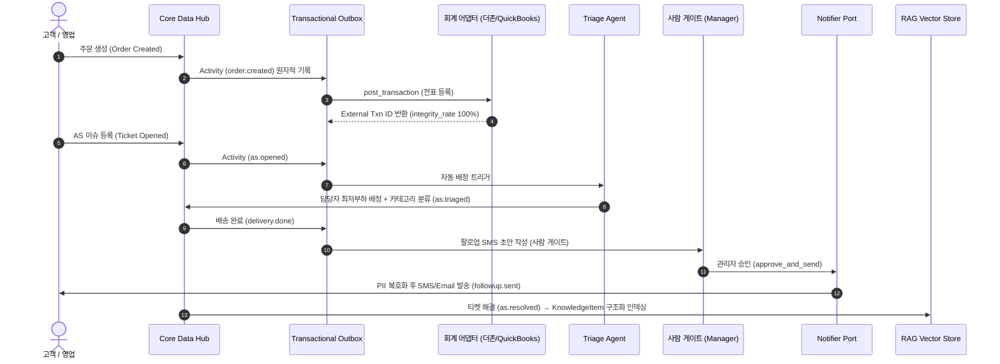
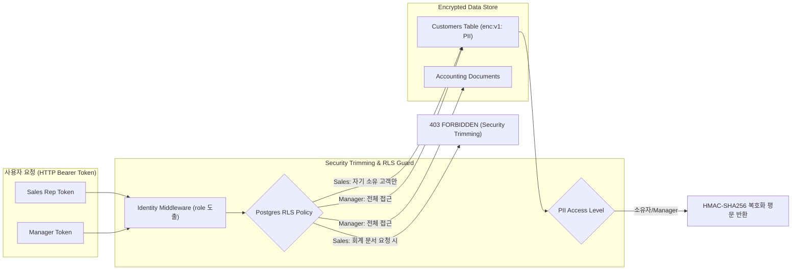

# Unified Ops AX — 전사 통합 운영체계 아키텍처 & 다이어그램

> **[interactive Dashboard View](./unified_ops_ax_dashboard.html)**  
> *대시보드 HTML 파일을 클릭하면 브라우저에서 5-Layer 아키텍처 Topology, 이벤트 버스 라이브 시뮬레이션, RLS 보안 권한 조회를 직접 대화형으로 체험할 수 있습니다.*

---

## 1. 전사 5-Layer 시스템 아키텍처 (5-Layer Architecture Topology)

Unified Ops AX는 단일 `Activity` 이벤트 스트림을 중심으로 성과관리, 회계 정합, 자동 인계, 고객 360° 프로필을 파생 뷰로 도출하는 **모듈러 모놀리스(Modular Monolith)** 아키텍처 구조를 갖추고 있습니다.

```mermaid
graph TD
    classDef exp fill:#8b5cf6,stroke:#7c3aed,color:#fff;
    classDef agent fill:#ec4899,stroke:#db2777,color:#fff;
    classDef hub fill:#3b82f6,stroke:#2563eb,color:#fff;
    classDef saas fill:#06b6d4,stroke:#0891b2,color:#fff;
    classDef conn fill:#10b981,stroke:#059669,color:#fff;

    subgraph L5["Layer 5. Experience Layer (app/experience/workspace.py)"]
        UI_MGR["Manager Executive Dashboard"]:::exp
        UI_SALES["Sales Rep Workspace"]:::exp
        UI_AS["AS Dispatcher Desk"]:::exp
        UI_PREF["Personalized User Preferences"]:::exp
    end

    subgraph L4["Layer 4. AI Agent Layer (app/agents/)"]
        AGT_CLS["Deterministic Keyword Classifier (rules.py)"]:::agent
        AGT_TRI["Automated AS Triage Agent (triage.py)"]:::agent
        AGT_KNOW["Knowledge Capture Agent (knowledge.py)"]:::agent
        AGT_FOL["HITL FollowUp Agent (followup.py)"]:::agent
    end

    subgraph L3["Layer 3. Core Data Hub & Event Bus (app/events/)"]
        EVT_STREAM["Activity Event Stream"]:::hub
        OUTBOX["Transactional Outbox (dispatch.py)"]:::hub
        RLS_ENGINE["Postgres RLS Policy Engine"]:::hub
        PII_ENC["PII HMAC-SHA256 Encryption"]:::hub
        MCP_SRV["MCP JSON-RPC 2.0 Server (7 Tools)"]:::hub
    end

    subgraph L2["Layer 2. SaaS Integration Orchestration (app/orchestration/)"]
        ORCH_ACC["Accounting Reconciler (integrity_rate ≥ 0.99)"]:::saas
        ORCH_CAL["Calendar Two-Way Sync (Last-Write-Wins)"]:::saas
    end

    subgraph L1["Layer 1. SaaS & On-Prem Connectors (app/connectors/)"]
        CONN_DZ["Douzone ERP REST Adapter"]:::conn
        CONN_QBO["QuickBooks Online v3 Adapter"]:::conn
        CONN_GRAPH["MS Graph Calendar & SharePoint"]:::conn
        CONN_GCAL["Google Calendar API v3 Adapter"]:::conn
        CONN_META["Meta Ads Performance Adapter"]:::conn
    end

    UI_MGR --> RLS_ENGINE
    UI_SALES --> RLS_ENGINE
    UI_AS --> RLS_ENGINE

    L4 --> EVT_STREAM
    OUTBOX --> AGT_TRI
    OUTBOX --> AGT_FOL
    OUTBOX --> AGT_KNOW

    EVT_STREAM --> ORCH_ACC
    EVT_STREAM --> ORCH_CAL

    ORCH_ACC --> CONN_DZ
    ORCH_ACC --> CONN_QBO
    ORCH_CAL --> CONN_GRAPH
    ORCH_CAL --> CONN_GCAL
```

---

## 2. 파이프라인 데이터 흐름 다이어그램 (Event Stream & Automated Pipeline)

주문 생성부터 회계 전표 작성, AS 이슈 자동 배정, HITL 승인 발송, RAG 지식 자동 인덱싱까지의 종단간 데이터 흐름입니다.

---

## 3. RLS & PII 보안 데이터 격리 구조 (Security Trimming Architecture)

---

## 4. 커넥터 및 검증 현황 요약 (Verification Summary)

| 커넥터 / 사양 | 프로토콜 & 어댑터 | 오프라인 검증 상태 |
| :--- | :--- | :--- |
| **더존(Douzone) ERP** | REST API (`/api/v1/voucher/*`) | `httpx.MockTransport` 전표 등록 및 대사 100% 통과 |
| **Intuit QuickBooks** | REST v3 (`Invoice` & `CreditMemo`) | OAuth2 토큰 기반 멱등 환불 및 정합 검증 통과 |
| **MS Graph Calendar** | Microsoft Graph REST API | 캘린더 양방향 Push/Pull Upsert 검증 통과 |
| **Google Calendar** | Google Calendar API v3 | Service Account 기반 캘린더 CRUD 통과 |
| **Meta Ads Performance** | Graph API v19.0 | Spend, Impressions, CTR, CPA 집계 통과 |
| **SharePoint / Teams** | Graph Client & stdlib Parsers | `.docx`/`.pdf` 바이너리 추출 및 ACL Trimming 통과 |
| **MCP Server** | JSON-RPC 2.0 (stdio + HTTP) | 도구 7종 목록 및 `tools/call` 원격 호출 통과 |

* **유닛 테스트**: `pytest -q` → **91/91 Passed**
* **종단간 오프라인 검증**: `python verify.py` → **15/15 Passed**

---
*시각화 웹 대시보드: [unified_ops_ax_dashboard.html](./unified_ops_ax_dashboard.html)*
